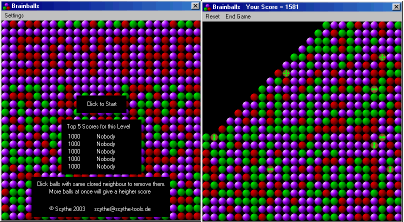



## Brainballs

### Description

A Tetris like game but a this one is complete new. I never found something similar on the net. Click balls with same clored neighbour to remove them. Balls will fall down an fill the hole but they also fall from the sides like they would in real live. 3 Gameversion each with 4 degree of difficulty. Cascade (by Fosters here on PSC), Balls and Balls with Bombs. About 40K for the exe. Easy code. No CPU usage. Runs from 95 to XP. I still search for ideas to improve the game. Vote if you like it.
 
### More Info
 

             |
---                |---
**Submitted On**   |2003-09-26 05:05:02
**By**             |[Scythe](https://github.com/Planet-Source-Code/PSCIndex/blob/master/ByAuthor/scythe.md)
**Level**          |Intermediate
**User Rating**    |4.9 (117 globes from 24 users)
**Compatibility**  |VB 5\.0, VB 6\.0
**Category**       |[Games](https://github.com/Planet-Source-Code/PSCIndex/blob/master/ByCategory/games__1-38.md)
**World**          |[Visual Basic](https://github.com/Planet-Source-Code/PSCIndex/blob/master/ByWorld/visual-basic.md)
**Archive File**   |[Brainballs1650229262003\.zip](https://github.com/Planet-Source-Code/scythe-brainballs__1-48788/archive/master.zip)

